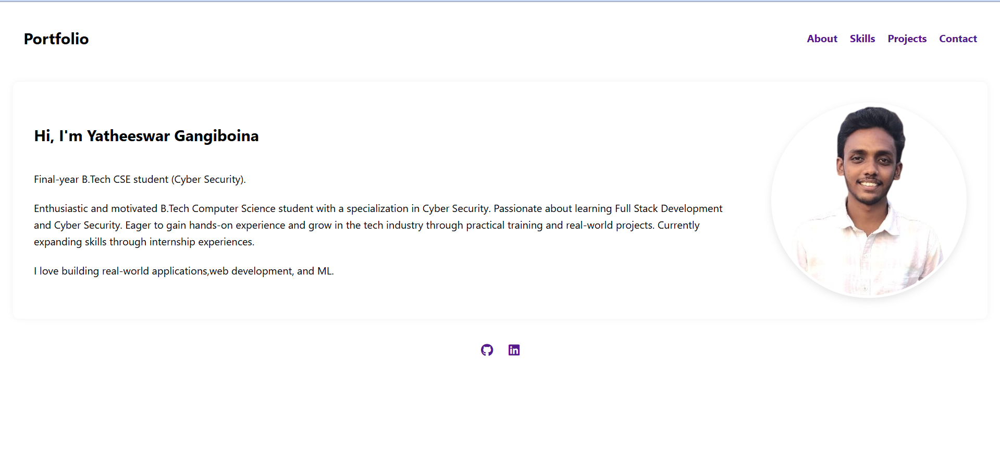
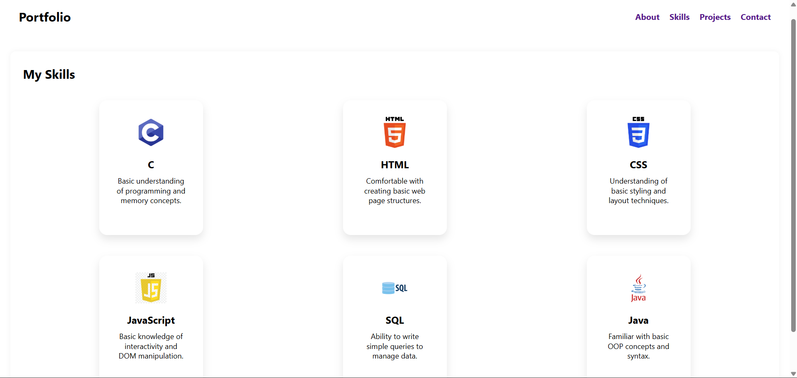
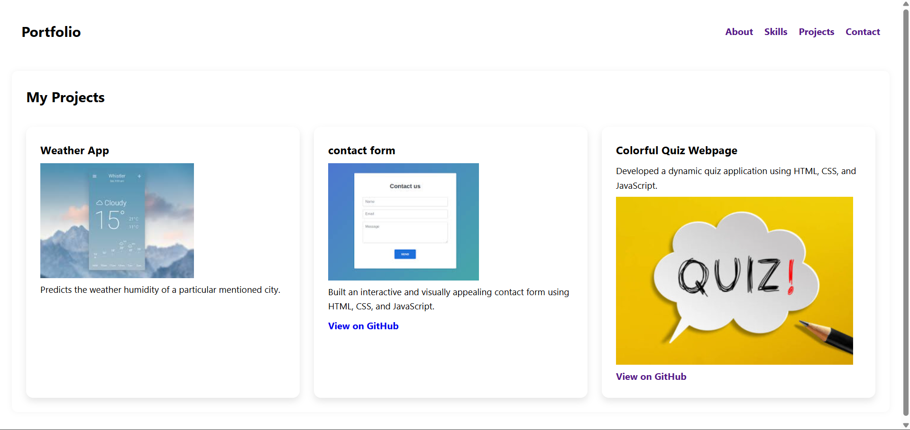
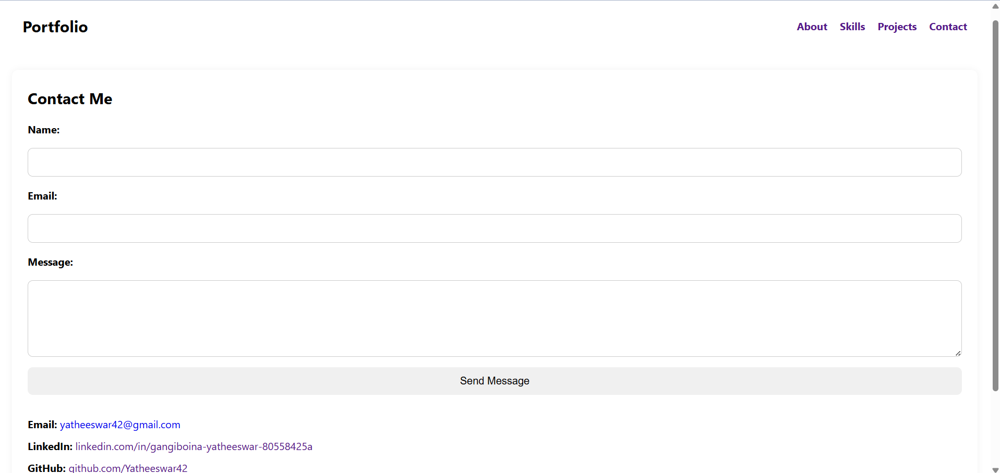

# 🌟 Portfolio Website

Welcome to my personal portfolio repository!  
This website is designed to showcase my skills, projects, and contact information in a fully responsive, modern, and professional layout.

---

## 🔗 Live Site

👉  https://yatheeswar42.github.io/Apex-task-4-portfolio/

---

## 💡 Project Overview

This portfolio website serves as a digital representation of my professional journey. It highlights my technical skills, the projects I have built, and provides a platform for potential employers, collaborators, or clients to reach out to me.

---

## ✨ Key Highlights

- **Fully Responsive Design**: Optimized for all devices (desktop, tablet, mobile).
- **Separate Pages for Each Section**:
  - About
  - Skills
  - Projects
  - Contact
- **Modern UI/UX**: Clean design, soft color palette, and smooth animations for better user engagement.
- **Interactive Contact Form**: Simple and effective way to get in touch.
- **Optimized Codebase**: Well-structured, readable, and maintainable code.
- **Deployed and Version Controlled**: Managed using Git and GitHub.

---

## 🧰 Tech Stack

- HTML5
- CSS3
- JavaScript (Vanilla)
- Responsive Web Design (Flexbox, Grid, Media Queries)
- CSS Animations & Transitions
- Google Fonts
- Git & GitHub

---

## 🚀 Getting Started

git clone https://github.com/Yatheeswar42/Apex-task-4-portfolio.git

cd Apex-Task-4-Portfolio

## 📸 Screenshots

* Home Page of the Portfolio Website showcasing the hero section and navbar.*

* Skills page listing my technical competencies with clean icons and responsive layout.*

* Projects Page listing my completed projects with animations.*

* Contact Page with fully functional form for user queries.*

